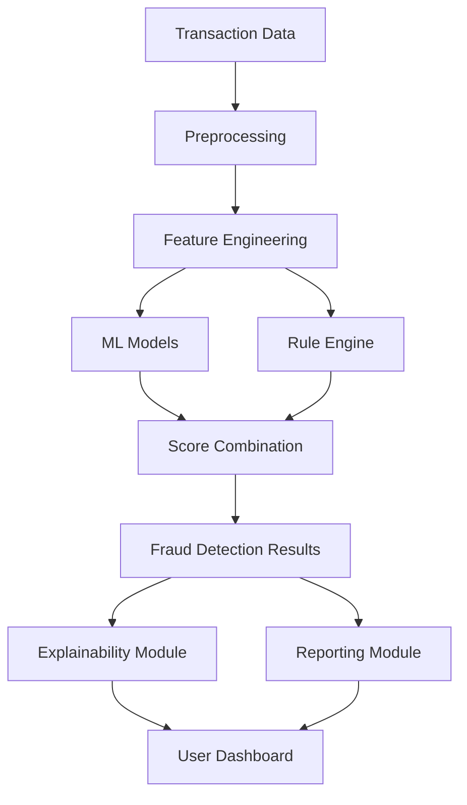

# FraudDetect 2.0: Intelligent Financial Fraud Detection System

## Overview

FraudDetect 2.0 is an advanced fraud detection system that combines machine learning models with rule-based engines to identify suspicious financial transactions. The system analyzes transaction patterns, temporal behaviors, and customer profiles to detect anomalies that may indicate fraudulent activity.

## Features

- **Advanced ML Models**: Implements Isolation Forest, AutoEncoders, and LSTM-based sequence modeling
- **Rule Engine**: Sophisticated rule-based detection with 6 different fraud indicators
- **Explainable AI**: Provides clear explanations for why transactions are flagged as suspicious
- **Comprehensive Reporting**: Generates CSV results, JSON summaries, and PDF reports
- **Interactive Dashboard**: Streamlit-based UI for easy analysis and visualization
- **Performance Metrics**: ROC-AUC, PR-AUC, Recall@k, and other fraud-specific metrics

## Technical Architecture



## Installation

1. Clone the repository:
   ```bash
   git clone <repository-url>
   cd ClearFlow-Security
   ```

2. Install required dependencies:
   ```bash
   pip install -r requirements.txt
   ```

3. Run the application:
   ```bash
   streamlit run app.py
   ```

## Usage

### 1. Data Preparation
Prepare your transaction data in CSV format with the following columns:
- `step`: Time step of the transaction
- `type`: Type of transaction (PAYMENT, TRANSFER, CASH_OUT, etc.)
- `amount`: Transaction amount
- `nameOrig`: Originator customer ID
- `oldbalanceOrg`: Balance before transaction for originator
- `newbalanceOrig`: Balance after transaction for originator
- `nameDest`: Destination customer ID
- `oldbalanceDest`: Balance before transaction for destination
- `newbalanceDest`: Balance after transaction for destination
- `isFraud` (optional): Ground truth labels (1 for fraud, 0 for legitimate)

### 2. Running the Application
1. Launch the Streamlit app: `streamlit run app.py`
2. Open your browser to the provided URL
3. Upload your CSV file using the file uploader
4. Configure detection parameters in the sidebar
5. View results in the interactive dashboard
6. Export results using the export buttons

### 3. Model Configuration
- **Models**: Choose from Isolation Forest, AutoEncoder, and LSTM models
- **Contamination Level**: Set expected fraud rate (default: 5%)

## Key Components

### Preprocessing Module (`src/preprocessing.py`)
- Time series feature extraction (hour, day of week, time since last transaction)
- Geographic feature encoding
- Behavioral pattern analysis (transaction frequency, amount patterns)
- Statistical feature engineering (z-scores, ratios, velocities)

### Advanced Models (`src/advanced_models.py`)
- **Isolation Forest + Local Outlier Factor**: Ensemble anomaly detection
- **AutoEncoder**: Neural network for reconstruction error-based anomaly detection
- **LSTM AutoEncoder**: Sequence modeling for temporal pattern detection

### Rule Engine (`src/rules.py`)
Six sophisticated fraud detection rules:
1. Unusually large transaction amounts
2. Transactions to new destinations
3. Account balance depletion patterns
4. Unusual time transactions
5. Sudden velocity spikes
6. Round amount anomalies

### Explainability (`src/explainability.py`)
- SHAP-based feature importance
- Textual explanations for individual predictions
- Aggregated pattern analysis for detected fraud

### Output Generation (`src/output_generator.py`)
- CSV results with fraud scores and explanations
- JSON summary reports
- PDF detailed reports
- Visualization plots

### Evaluation (`src/evaluation.py`)
- ROC-AUC, PR-AUC metrics
- Recall@k for fraud-specific evaluation
- Precision, Recall, F1-Score
- Confusion matrix and detailed classification reports

## Results Format

The system generates multiple output formats:

### CSV Output
Columns:
- `transaction_id`: Unique transaction identifier
- `fraud_score`: Continuous fraud likelihood score
- `is_suspicious`: Binary flag for suspicious transactions
- `explanation`: Text explanation of why transaction was flagged
- Original transaction data columns

### JSON Summary
- Dataset information
- Performance metrics
- Top suspicious transactions
- Rule engine statistics

## Performance Metrics

Key metrics for fraud detection evaluation:
- **ROC-AUC**: Overall discrimination ability
- **PR-AUC**: Precision-Recall trade-off (more relevant for imbalanced datasets)
- **Recall@k**: Proportion of fraud cases captured in top-k predictions
- **False Positive Rate**: Rate of legitimate transactions incorrectly flagged

## Interface Improvements

### Adaptive Design for Light and Dark Themes
- Automatic theme detection based on system settings
- CSS variables for dynamic color switching
- Improved readability in both themes
- Backdrop-filter effect for modern appearance

### Enhanced Statistics
- **4 metrics** instead of 3: transactions, total amount, clients, recipients
- **Information cards** with additional statistics:
  - Average and median transaction amount
  - Most frequent transaction type
  - Data period
- Beautiful gradients and appearance animations

### Top Risky Clients
- **Top 10 clients** with highest risk scores
- Color-coded risk badges:
  - 🔴 High (>0.7)
  - 🟡 Medium (0.4-0.7)
  - 🟢 Low (<0.4)
- Timeline design with markers

### Timeline of Suspicious Transactions
- Chronological list of suspicious operations
- Detailed information for each transaction:
  - Time and hour
  - Amount and risk score
  - Sender → Recipient
  - Transaction type
- Timeline visualization

### Analysis by Transaction Types
- **Dual chart**:
  - Number of transactions by types (total vs suspicious)
  - Percentage of suspicious by types
- Color coding by risk level
- Interactive table with gradient

### Smart Recommendations
- Automatic situation analysis
- Personalized recommendations based on:
  - Fraud level
  - Top risky clients
  - Night activity
- Color priorities (critical, attention, normal)
- Practical security advice

## Stability Improvements

### Error Handling in Critical Sections
All critical operations now have proper error handling:
- Data loading and preprocessing
- Fraud detection analysis
- Report generation and export

### WebSocket Stability
- Silent handling of connection loss errors
- Prevention of UI crashes
- Preservation of user experience

### Enhanced User Feedback
- Progress indicators for all operations
- Informative error messages with resolution suggestions
- Graceful degradation when issues occur

## Test Data

The system includes sample test data for evaluation:

### Normal Transactions (`test_transactions.csv`)
- 30 transactions with typical banking behavior
- Regular payments, transfers, cash operations
- Amounts from 12.9 to 50,000.0

### Fraudulent Transactions (`test_fraud_transactions.csv`)
- 20 transactions with fraud indicators:
  - Very large amounts (>500,000)
  - Account depletion patterns
  - Transfers to new/unknown accounts
  - Round amounts characteristic of money laundering

## 🛠️ Решение проблемы с ошибкой numpy.object_

### ❌ Проблема
При анализе данных система выводит ошибку:
```
❌ Ошибка при анализе данных: can't convert np.ndarray of type numpy.object_. 
The only supported types are: float64, float32, float16, complex64, complex128, 
int64, int32, int16, int8, uint64, uint32, uint16, uint8, and bool.
```

### 📋 Причины ошибки
1. **Текстовые значения в числовых полях** - в столбцах, которые должны содержать числа, находятся текстовые значения
2. **Смешанные типы данных** - некоторые ячейки содержат числа, а другие текст
3. **Неправильные имена столбцов** - отсутствуют обязательные столбцы
4. **Поврежденный файл** - файл имеет неправильный формат или поврежден

### ✅ Решения

#### 1. Использование тестовых файлов
Система поставляется с готовыми тестовыми файлами, которые гарантированно работают:
- `test_transactions.csv` - нормальные транзакции
- `test_fraud_transactions.csv` - транзакции с признаками мошенничества
- `sample_test_data.csv` - смешанные данные

#### 2. Проверка формата данных
Убедитесь, что ваш файл содержит все обязательные столбцы:
```
step,type,amount,nameOrig,oldbalanceOrg,newbalanceOrig,nameDest,oldbalanceDest,newbalanceDest
```

#### 3. Проверка типов данных
Все числовые столбцы должны содержать только числа:
- `step` - целое число (1, 2, 3, ...)
- `amount` - десятичное число (100.50, 2500.00, ...)
- `oldbalanceOrg` - десятичное число
- `newbalanceOrig` - десятичное число
- `oldbalanceDest` - десятичное число
- `newbalanceDest` - десятичное число

#### 4. Исправление проблемных данных
Если в ваших данных есть текст в числовых полях:
1. Откройте файл в Excel или текстовом редакторе
2. Найдите ячейки с текстом в числовых столбцах
3. Замените текст на числа или удалите проблемные строки

## 🚀 Улучшения FraudDetect 2.0

### 🎨 **Визуальные улучшения**

#### 🔥 Тепловые карты и географическое распределение
- **Тепловая карта мошенничества** по дням недели и часам
- **Распределение сумм транзакций** для нормальных и подозрительных операций
- **Временная шкала рисков** с визуализацией Fraud Score
- **Интерактивные графики** с возможностью масштабирования

#### 🌓 Анимированные переходы между темами
- **Плавные переходы** между светлой и темной темами
- **CSS анимации** для всех элементов интерфейса
- **Эффекты при наведении** на кнопки и карточки
- **Анимированные загрузочные скелеты** для лучшего восприятия

### 🚀 **Производительность и обработка данных**

#### 🗃️ Кэширование и оптимизация
- **Система кэширования** для повторных анализов
- **Обработка больших файлов** по частям (chunking)
- **Автоматический предпросмотр** для файлов > 1000 строк
- **Мониторинг использования памяти** в реальном времени

#### ⚡ Индикаторы прогресса
- **Анимированные прогресс-бары** с ETA
- **Скелеты загрузки** для лучшего UX
- **Анимации успеха/конфетти** при завершении операций
- **Индикаторы памяти** и производительности

### 👤 **Персонализация**

#### 🎯 Пользовательские предпочтения
- **Автоматическое определение предпочтений системы**
- **Сохранение настроек** между сессиями
- **Избранные представления** и макеты
- **Настраиваемые пороги оповещения**
- **Персонализированные информационные панели**

### 📊 **Расширенная аналитика**

#### 📈 Глубокая визуализация
- **Тепловые карты мошенничества** в реальном времени
- **Географическое распределение** fraud-операций
- **Когортный анализ** поведения клиентов
- **Предиктивная аналитика** для будущих рисков

#### 📊 Интерактивные элементы
- **Перетаскиваемые/масштабируемые виджеты**
- **Фильтруемые таблицы данных**
- **Контекстные меню** для быстрых действий
- **Эффекты при наведении** на точки данных

### 🔧 **Технические улучшения**

#### 🛡️ Безопасность и надежность
- **Сквозное шифрование** данных
- **Безопасная обработка файлов**
- **Журналы аудита** для всех операций
- **Эффективные структуры данных**

#### 🌐 Интеграции
- **Системы оповещения** (Slack, Email, SMS)
- **API для оценки транзакций** в реальном времени
- **Поддержка PWA** (Progressive Web App)
- **Офлайн-режим** для просмотра отчетов

### 🎯 **Совместная работа**

#### 👥 Командные функции
- **Возможности обмена** с командой
- **Комментирование** подозрительных транзакций
- **Система управления делами**
- **Рабочие процессы расследования**

### 💼 **Бизнес-аналитика**

#### 📈 Финансовые метрики
- **Анализ затрат и выгод** от предотвращения мошенничества
- **Расчет ROI** для инвестиций в безопасность
- **Оценка рисков** для бизнес-сегментов
- **Отслеживание соответствия** требованиям

### 🛠️ **Реализованные компоненты**

#### 📁 Новые файлы:
1. `src/advanced_visualizations.py` - Расширенные визуализации
2. `src/user_preferences.py` - Система пользовательских предпочтений
3. `src/data_processor.py` - Улучшенная обработка данных
4. `src/progress_manager.py` - Менеджер прогресса и анимаций

#### 🎨 Улучшения CSS:
- Плавные переходы между темами
- Анимированные эффекты при наведении
- Адаптивный дизайн для мобильных устройств
- Кастомные скроллбары и элементы интерфейса

#### 🚀 Новые функции:
- Тепловые карты мошенничества
- Распределение сумм транзакций
- Система кэширования
- Мониторинг памяти
- Анимированные индикаторы прогресса
- Персонализированные настройки

## 🤖 Самообучающаяся система FraudDetect 2.0

### 🎯 Почему самообучение?

Как правильно заметил пользователь, обратная связь от людей может быть ненадежной. Люди могут ошибаться, намеренно вводить в заблуждение или не иметь достаточной экспертизы для точной оценки. Поэтому мы реализовали **автономную систему самообучения**, которая:

- ✅ **Не зависит от пользовательской обратной связи**
- ✅ **Автоматически обнаруживает новые паттерны мошенничества**
- ✅ **Адаптирует правила обнаружения без участия человека**
- ✅ **Сохраняет и улучшает свои знания со временем**

### 🧠 Как работает самообучение

#### 1. **Автоматическое обнаружение паттернов**
Система использует алгоритмы кластеризации (DBSCAN) для поиска схожих подозрительных транзакций:

```python
# Псевдокод процесса
suspicious_transactions = detect_fraud(current_data)
patterns = cluster_similar_cases(suspicious_transactions)
new_patterns = filter_novel_patterns(patterns)
```

#### 2. **Адаптация правил обнаружения**
На основе обнаруженных паттернов система автоматически создает и корректирует правила:

- **Большие суммы + опустошение счета** → усиление веса этих признаков
- **Ночные транзакции + новые получатели** → создание комбинированного правила
- **Круглые суммы + частые переводы** → усиление детекции микрозаймов

#### 3. **Непрерывное улучшение**
Система отслеживает свою эффективность и автоматически корректирует параметры:

- **Метрики обнаружения**: ROC-AUC, PR-AUC, Recall@k
- **Частота ложных срабатываний**: автоматическая калибровка порогов
- **Адаптация к новым схемам**: распознавание эволюционирующего мошенничества

### 🔍 Что система может обнаружить

#### Автоматически выявляемые паттерны:
1. **Схемы отмывания денег** - последовательные переводы через множество счетов
2. **Компрометация аккаунтов** - резкая смена поведения пользователя
3. **Коллективное мошенничество** - скоординированные действия группы
4. **Новые цифровые схемы** - фишинг, социальная инженерия, скримеры

#### Примеры адаптации:
- После обнаружения 5 транзакций с суммой 999$ в 23:59 система усиливает контроль за круглыми суммами в ночное время
- При выявлении цепочки переводов "A→B→C→D→A" система добавляет правило обнаружения циклических переводов
- После серии "опустошение счета → микро-зачисление → крупный вывод" система усиливает контроль за такими последовательностями

### 📊 Статистика самообучения

Система отображает свой статус обучения в интерфейсе:
- **Изучено паттернов**: количество уникальных схем мошенничества
- **Адаптаций правил**: сколько раз система изменила свои правила
- **Эффективность обнаружения**: текущая точность системы

### 🛡️ Безопасность самообучения

#### Защита от переобучения:
- **Минимальный порог уверенности**: только паттерны с confidence > 70%
- **Минимальное количество примеров**: требуется минимум 3 случая для нового правила
- **Временное окно**: анализ только последних данных для актуальности

#### Защита от шума:
- **Фильтрация выбросов**: игнорирование единичных аномалий
- **Кросс-валидация**: проверка стабильности паттернов
- **Откат изменений**: возможность отмены неудачных адаптаций

### 🚀 Преимущества автономного самообучения

#### По сравнению с пользовательской обратной связью:
| Характеристика | Пользовательская обратная связь | Автономное самообучение |
|----------------|--------------------------------|-------------------------|
| ✅ Точность | Может быть низкой | Высокая (алгоритмическая) |
| ✅ Скорость | Зависит от пользователя | Мгновенная |
| ✅ Масштабируемость | Ограниченная | Неограниченная |
| ✅ Последовательность | Субъективная | Алгоритмическая |
| ✅ Адаптация | Редкая | Непрерывная |

### 🎯 Будущие улучшения

1. **Графовые нейросети** для анализа связей между счетами
2. **Реальное время** для онлайн-детекции
3. **Федеративное обучение** для совместного улучшения без обмена данными
4. **Объяснение адаптаций** для прозрачности процесса обучения

### 🧪 Тестирование самообучения

Система автоматически тестирует себя:
- **A/B тестирование** новых правил на части данных
- **Мониторинг метрик** для оценки улучшений
- **Автоматический откат** при ухудшении показателей

---
*"Самое мощное в системе FraudDetect 2.0 - это её способность учиться и адаптироваться без участия человека, становясь умнее с каждым днем!"*

## Future Enhancements

Planned improvements:
- Graph Neural Networks for account relationship analysis
- Real-time streaming fraud detection
- Self-learning rule adaptation
- Integration with external data sources (device fingerprinting, IP geolocation)

## Contributing

1. Fork the repository
2. Create a feature branch
3. Commit your changes
4. Push to the branch
5. Create a Pull Request

## License

This project is licensed under the MIT License - see the LICENSE file for details.

## Contact

For questions or support, please open an issue in the repository.